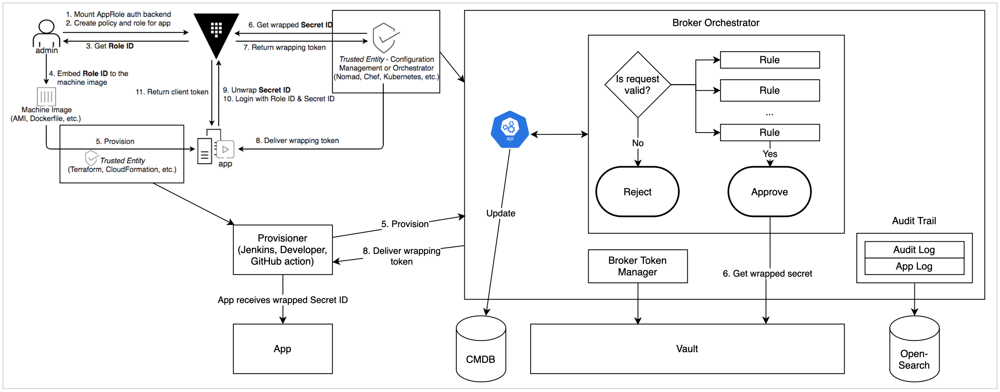

# NR Broker

NR Broker is a customizable software deployment business intelligence tool. It automates access to secrets stored in [HashiCorp Vault](https://www.vaultproject.io) by software (applications, GitHub Actions, etc.), audits activities (builds, installations, provisioning secrets, etc.) and enables access automation.

Users can search, browse objects, view a graph representation and review activities using a web application. Developers integrate NR Broker into workflows by sending their intentions, requesting access and recording activity using http requests. As such, NR broker works on private on-premise clouds, AWS, OpenShift Clouds and more.

## Deployment Specific Information

If this documentation refers to things as 'deployment specific' then you should refer to your own documentation. Your deployment should show a link to your documentation on the homepage.

This documentation is generic to all NR Broker installations.
