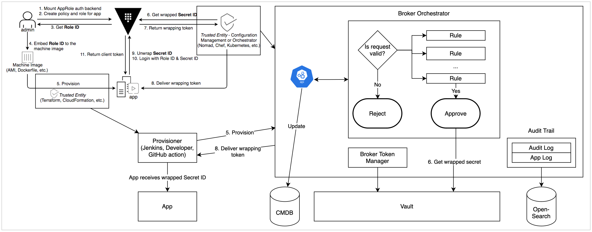

# NR Broker

NR Broker is a customizable software deployment business intelligence tool. It automates access to secrets stored in [HashiCorp Vault](https://www.vaultproject.io), audits deployment activities (builds, installations, provisioning, and more), and enables access automation.

Users can search, browse objects, view a graph representation, and review activities using a web application. Developers integrate NR Broker into workflows by sending intentions — validated requests that describe what they want to do. As such, NR Broker works on private on-premise clouds, AWS, OpenShift, and more.

## Who is this documentation for?

This documentation serves three main audiences:

### Team Owners

If you're responsible for delivering services or applications, these pages explain how Broker helps your team:

- [Team Owner Quick Start](/ops_team_overview.md) — What a team owner does and where to go next
- [Manage My Team](/ops_manage_team.md) — Adding members and managing roles
- [Broker Accounts](/ops_broker_account.md) — Service identities for your projects

### Developers

If you're building or deploying software and need to integrate with Broker, start here:

- [Developer Quick Start](/ops_quick_start.md) — How to get on a team and what you'll work with
- [Broker Account Tokens](/dev_account_token.md) — What tokens are and how they relate to services and intentions
- [Understanding Vault](/dev_vault_for_developers.md) — How Vault stores and protects your secrets
- [Integrating Overview](/dev_integrate_overview.md) — How Broker accounts, teams, and intentions work together
- [Intention Lifecycle](/dev_intention_lifecycle.md) — Step-by-step guide to opening and closing intentions
- [Using Intentions to Access Vault](/dev_intention_usage.md) — Full walkthrough with API examples
- [GitHub Actions](/github_actions.md) — Pre-built actions for CI/CD workflows

### NR Broker Platform Developers

If you're contributing to the NR Broker codebase or customizing the platform:

- [Local Dev Setup](/development.md) — Getting a development environment running
- [Validation Rules Architecture](/dev_validation_rules.md) — How business rules are evaluated
- [Data Transfer Objects](/dev_dto_entities.md) — DTO and entity conventions
- [MongoDB](/dev_mongodb.md) — Database setup and management
- [Vault](/dev_vault.md) — Vault configuration for development
- [Document Site](/dev_docsite.md) — Running and contributing to this documentation

## Deployment-Specific Information

If this documentation refers to something as 'deployment specific', you should refer to your own organization's documentation. Your deployment should show a link to that documentation on the homepage.

This documentation is generic to all NR Broker installations.

## What's an NR?

While initially written for the Province of British Columbia's Natural Resource Ministries, the "NR" doesn't stand for anything. It's a retronym that emerged after the "broker" became a product. A decent backronym for "NR" is "New Release."