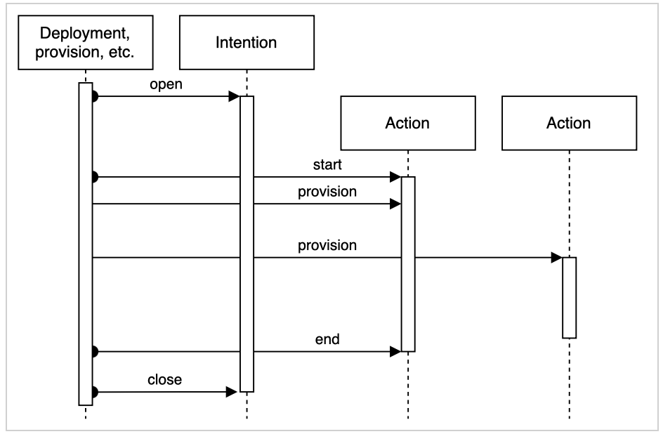

# Intention Lifecycle

Broker tokens created from a Broker Account are used to interact with the NR Broker API. This document will show how to use the token to open an intention to document and track your actions.

Certain actions can allow your service to request access to Vault using the NR Broker API. Other actions let you record created artifacts, install information and more.

## Starting an intention

Opening an intention validates if the requested actions are satisfy the business rules.

* Provisioner opens intention with Broker API with required actions
* Broker determines if business rules are satisfied for the actions
  * Success: Return intention and action token(s)
  * Failure: Return failed business rule(s)
* Broker audits activity

Swagger: /api#/default/IntentionController_openIntention

## Starting an intention with quick start

If your intention has a single action, quick start can reduce the number of calls to the broker. If you send the "quickstart=true" query parameter on the open, the broker automatically starts the action after opening the intention. This also means you will not need to call broker to stop the action because started actions are ended upon closing an intention. This saves you from making two api calls.

## Starting an action

Starting an action is optional but helps track and benchmark the steps in the intention.

* Provisioner starts action with Broker API
* Provisioner performs activities associated with action
* Provisioner ends action with Broker API

Swagger: /api#/default/IntentionController_actionStart

## Provisioning a secret id / token

See: [Intention Usage](/dev_intention_usage.md)

**Prerequisites:** Intention opened

* Provisioner provides role id and action token
* Broker records audit log for request
* If request is successful, provisioner receives wrapped token
* Response unwrapped and used by requesting provisioner

**Notes**

* A secret id would be used to provision an application to login and generate its own tokens
* A token would be used to do some kind of configuration (database automation for example)

## Ending an action

Ending an action is optional, but it helps track and benchmark the steps in the intention. Actions should end as soon as the activity ends. So, if you are using an action to retrieve secrets then the action should end as soon as you have read the secrets.

Swagger: /api#/default/IntentionController_actionEnd

## Closing an intention

The intention should be closed regardless of outcome (unless it failed to satisfy the business rules). All started actions will automatically be ended upon closing the intention.

**Prerequisites:** Intention opened

Provisioner calls Broker API to record success or failure of activity using intention token
Broker records end of intention

Swagger: /api#/default/IntentionController_closeIntention
